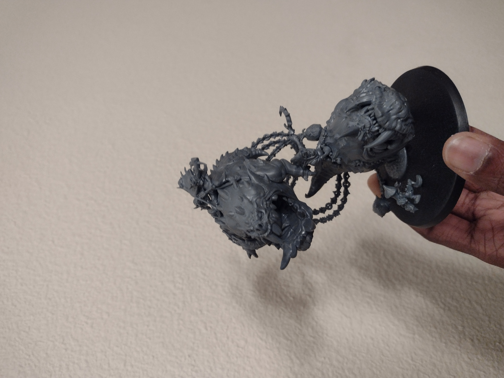
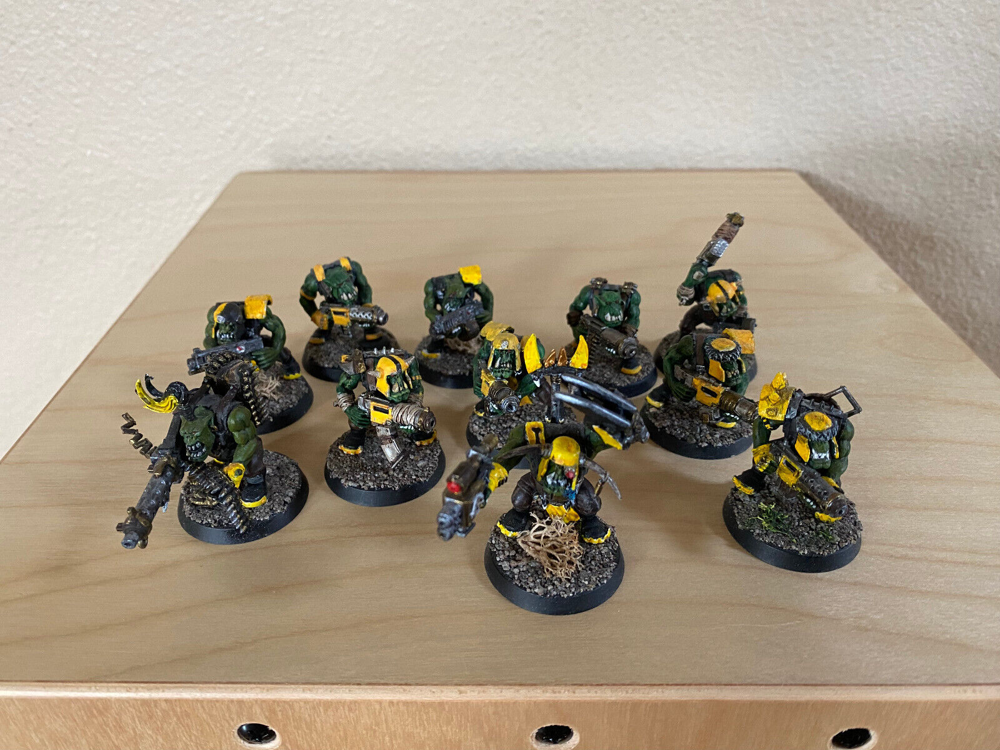

```{r setup, include=FALSE}
knitr::opts_chunk$set(echo = TRUE)
```

## A little about me

My name is Reuben Abraham. I am an Accounting and OTM double major in my Junior year. I have never used any programming languages prior to this class, and so I hope I will be able to use R for my other business classes and beyond. Outside of school, my main hobby is painting miniature model kits. 



### Here are some older models I painted a while ago:



**Here is some Bold text.**
*Here is some italic text!*

Packages | Functions
-------- | ---------
row1 | row2 = cell2
this is | a neat <br> feature

[Here is a really awesome and cool hyperlink.](https://www.youtube.com/watch?app=desktop&v=dQw4w9WgXcQ)